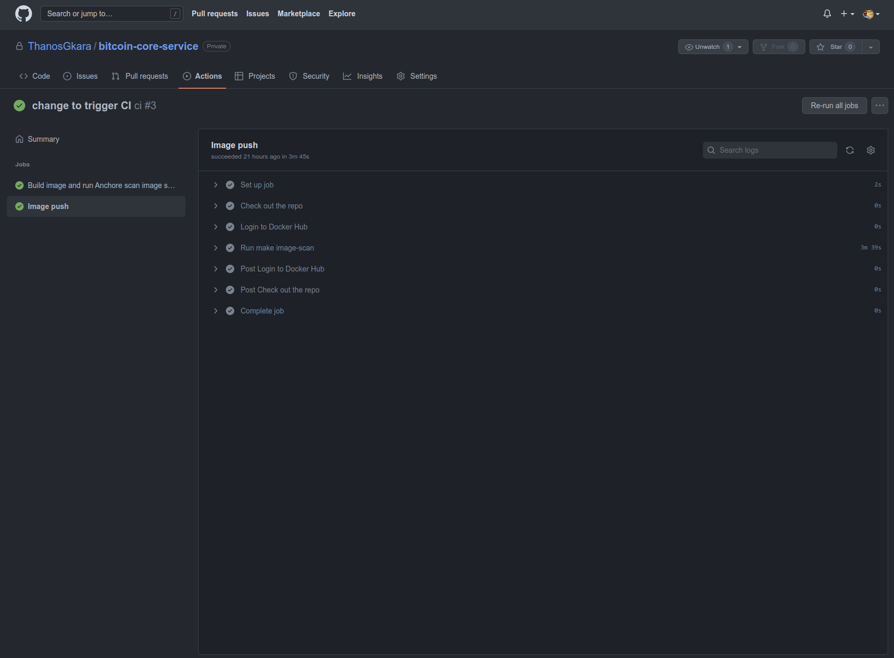
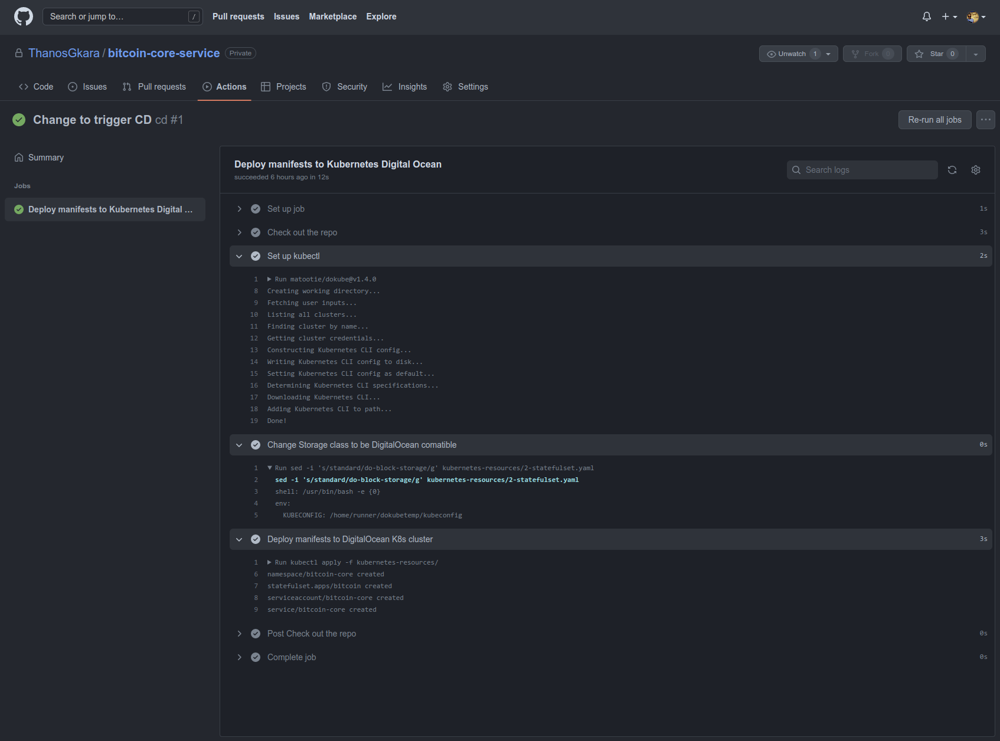

This following README presents the solutions to the take home exercise along with their respective explanations and how they can be replicated.

**Readme Contents**

[1 - Environment requirements](#1---Environment-requirements)  
[2 - Project file structure](#2---Project-file-structure)  
[3 - Solutions](#3---Solutions)  
[4 - Revert all](#4---Revert-all)  

## 1 - Versions of Software used

To test the solutions Linux is recommended.   
*Please note though that this solution was tested using Linux Fedora 36*

The following tools/languages/OSs were used to complete this exercise. They are listed below along with the versions used.


| Name | Version |
| --- | --- |
| [Docker](https://hub.docker.com/) |  20.10.17 |
| [Kubectl](https://kubernetes.io/docs/tasks/tools/) | 1.24.2 |
| [Kind](https://kind.sigs.k8s.io) | 0.14.0 |
| [Kubernetes](https://kubernetes.io/) | 1.22.8-do |
| [Nomad](https://www.nomadproject.io/) | 1.3.1-1 |
| [Terraform](https://terraform.io)| 1.2.3 |
| [Tflint](https://github.com/terraform-linters/tflint) | 0.38.1 |
| [Anchore](https://ci-tools.anchore.io/inline_scan-latest) | 0.10.2 |
| [GNU Make](https://www.gnu.org)  | 4.3 |
| [Python](https://www.python.org) | 3.10.5 |
| [Fedora](https://getfedora.org/en/) | 36 |
| Linux Kernel | 5.18.6-200 |
| [Github Actions](https://github.com) | |


## 2 - Project file structure
Bellow you can have a preview of structure used in this project and each directory is used for

| Directory/file | Description |
| --- | --- |
| Dockerfile | Question 1 solution (Dockerfile) |
| anchor-reports | Question 1 solution (Anchore scan reports) |
| kubernetes-resources | Question 2 solution |
| .github/workflows | Question 3 solution |
| webserver-log | Questions 4 and 5 solutions |
| terraform | Question 6 solution |
| nomad-resources | Question 7 solution |


## 3 - Solutions
*Note: A make file is being used which can be found under the root of the project to ease the execution of each solution.  
All commands are meant to be run from the project's root.
For the full list of commands run: `make help`.*
### 3.1 - Question 1: Docker-ayes
This Dockerfile utilizes the Docker multi stage build. This approach helped building the container faster locally, since it does always download all the parts. Moreover to achieve security Google's [Distroless-nonroot](https://github.com/GoogleContainerTools/distroless) image is used, which is based on Debian Linux. This specific image reduces the attack surface of the container by not including most parts of a standard container image. It provides the bare minimum and users are able to use only the very essentials to run an application.

The following links used as reference to create the Dockerfile:
https://github.com/kylemanna/docker-bitcoind/blob/master/Dockerfile
https://github.com/lncm/docker-bitcoind/blob/master/23.0/Dockerfile
https://github.com/FelixWeis/docker-bitcoind/blob/master/0.15/Dockerfile
https://github.com/anchore

#### 3.1.1 - Execution steps
To build the bitcoin-core docker image run: (build the image using the Dockerfile in the project dir)
```bash
make build-image
```

To start the bitcoin-core container with console output, run:
```bash
make run-image
```
To scan the container image using anchore run:
```bash
make image-scan
```
The results of the scan are automatically stored under `anchore-reports` in the root of the project


### 3.2 - Question 2: k8s FTW
#### 3.2.1 - A local cluster
For fast testing of this solution we use [Kind](https://kind.sigs.k8s.io) which creates a K8s cluster using docker containers as nodes.
It provides for a very lightweight and simple solution than running a full VM on Linux using this [configuration](https://github.com/kubernetes-sigs/kind/blob/main/site/content/docs/user/kind-example-config.yaml). 

*Note: kind has some limitations as its not a full fledged cluster, for more standard testing a proper K8s cluster must be used.*

#### 3.2.1 - The manifests
The Kubernetes manifests which create all the required objects can be found under  `kubernetes-resources`.  
Each Object has its own filename for better visibility of what is deployed.  Note that we do not have a StorageClass manifest. This is because we are going to use the `standard` StorageClass that comes baked in with the Kind Kubernetes cluster. 
PV and PVC are not required when using Kind since the statefulset being used has the field `volumeClaimTemplates:` (line 41 in 2-statefulset.yaml) and provides all the functionality we need, i.e. creation of PVC and PV that uses the existing `standard` storage class. This storage class is replaced when we deploy it on a proper Kubernetes cluster ( depending on the provider - each one has different StorageClass names )
#### 3.2.2 - Execution steps

Create the kind k8s cluster and deploy:
```
make deploy-to-kind
```

### 3.3 - Question 3: All the continuouses
Under the `.github/workflows` directory, the files `ci.yaml` and `cd.yaml` define Github Actions workflows for Continues Integration and Continues Delivery.  
The CI/CD concept is the following:  
- Both workflows target specific parts of the repository on the `main` branch and are only triggered for specific changes.
- CI workflow is triggered in case any changes happen to the `Dockerfile`.
- CD workflow is triggered in case any changes happen to any file under the `kubernetes-resources` directory.
- Here we assume we only have one environment and all changes happen to the `main` branch.  

A more detailed explanation of the stages:    
1. Build the docker image  
2. Scans the docker image  
For this we are using `anchor` and it comes nicely package in a container.   
3. Pushes the container image to Dockerhub
4. Applies the Kubernetes manifests to DigitalOcean Kubernetes cluster.

The concept here is, that merging to `main` branch,  triggers an automated production deployment since the DEV and QA stages have previously been GREEN.  

For the Github Actions output log please look at [Actions Tab](https://github.com/ThanosGkara/bitcoin-core-service/actions). 



Further optimization would be: 
- rum e2e and smokes as the production deployment occurs.  
- Have a canary deployment to switch only a % of traffic to the new version.  
- Have a revert stage at the end of the pipeline if the e2e, and smoke tests fail after deployment.  

### 3.4 - Question 4: Script kiddies
At this stage we used the provided output to create a larger `webserver-log/sample-web-log.log`. We tried to put some random IP addresses
to satisfy the purpose of this part.

We also provide the equivalent one-liner to check that our script produces the correct output.

The script can be found `webserver-log/ip-frequency.sh` directory. The script is using hash-table of bash to mimic the functionality of dictionaries.
The script reads the file line by line, extracting the ip part each line, Then increases the counter of each IP by one to achieve the final result.

To execute it run:
```bash
make script-kiddies
```

Script output:
```bash
make script-kiddies
cat webserver-log/sample-web-log.log | cut -d " " -f2 | sort | uniq -c | sort -nr
     26 192.168.21.34
     10 192.168.21.3
      4 192.168.21.4
      4 192.168.21.2
      4 192.168.21.120
      2 192.168.21.90
      2 192.168.21.56
      2 192.168.21.44
      2 192.168.21.20
      2 192.168.21.1
cd webserver-log && ./ip-frequency.sh sample-web-log.log
26 192.168.21.34
10 192.168.21.3
4 192.168.21.4
4 192.168.21.2
4 192.168.21.120
2 192.168.21.90
2 192.168.21.56
2 192.168.21.44
2 192.168.21.20
2 192.168.21.1
```

### 3.5 - Question 5: Script grownups
Taking into consideration the exact same scenario from Question 4, we now achieve the same result using Python.
The Python script is located at `webserver-log/ip-frequency.sh`.

To execute it run:
```bash
make script-grownups
```
The python code follows the same practice using `dict` to achieve the same result.

Script output:
```bash
make script-grownups
cat webserver-log/sample-web-log.log | cut -d " " -f2 | sort | uniq -c | sort -nr
     26 192.168.21.34
     10 192.168.21.3
      4 192.168.21.4
      4 192.168.21.2
      4 192.168.21.120
      2 192.168.21.90
      2 192.168.21.56
      2 192.168.21.44
      2 192.168.21.20
      2 192.168.21.1
cd webserver-log && python3 ip-freq.py sample-web-log.log
26 192.168.21.34
10 192.168.21.3
4 192.168.21.2
4 192.168.21.120
4 192.168.21.4
2 192.168.21.90
2 192.168.21.20
2 192.168.21.56
2 192.168.21.1
2 192.168.21.44
```

### 3.6 - Question 6: Terraform lovers unite
#### Terraform directory structure explanation
Under the `terraform` directory we see the following:  

| Directory | Description |
| --- | --- |
| terraform/main | IAM resource files |
| terraform/modules/iam | IAM module resource files |
| terraform/\*outputs\*.log | example outputs of successful runs |

For a more detailed explanation on how the terraform code works please look at the inline comments.
*Note: Credentials are located under `~/.aws/credentials`

To create the IAM resources run:
```bash
make run-terraform
```
The above commands run `terraform init`, `terraform plan`  and `terraform apply` in the respective directories with `-auto-approve`.

### 3.7 - Question 7: Nomad users WAGMI
At this stage we created a Nomad Job file which tries to be equivalent to the Kubernetes manifest running the same application.
The job file can be found `nomad-resources/bitcoin-core.nomad`

#### Environment setup
We used as local Nomad agent running in dev mode. 
```bash
nomad agent -dev -bind 127.0.0.1 -log-level DEBUG
```
*Note: We didn't use Consul so the parts of the job that expose a service ( lines 47-136 ) cannot be used in this case.
*Note: The volume mounts cannot be used unless we provide a volume to utilized by Nomad.

#### Nomad Job
The job was created using the a [template](https://learn.hashicorp.com/tutorials/nomad/stateful-workloads-host-volumes?in=nomad/stateful-workloads#create-the-job-file).

To run the Nomad job use the following command:
```bash
make run-nomad-job
```

### 3.8 - Revert all

To remove all the resources build from the above sections, from within the project root run:
```
make revert-all
```